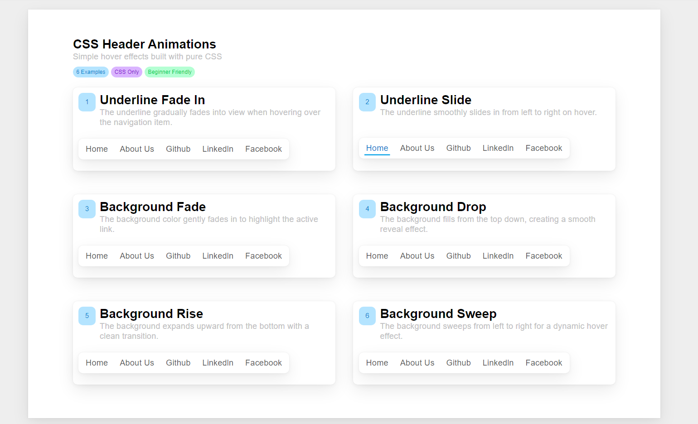

# CSS Header Animations

A collection of modern **CSS-only header hover animations**. Explore elegant underline and background effects built with pure HTML and CSS—lightweight, responsive, and easy to customize.



## ✨ Features

- 🎨 6 modern hover animation effects
- 💯 Built with pure HTML & CSS
- ⚡ No JavaScript required
- 📱 Responsive design
- 🧩 Easy to customize and reuse
- 🚀 Perfect for portfolios, landing pages, and navigation menus

## 📂 Animation Collection

| Animation                | Description                                       |
| ------------------------ | ------------------------------------------------- |
| Underline Fade In        | The underline gradually fades into view on hover. |
| Underline Slide          | The underline smoothly slides from left to right. |
| Background Fade          | The background gently fades in.                   |
| Background Top Down      | The background fills from top to bottom.          |
| Background Bottom Up     | The background fills from bottom to top.          |
| Background Left to Right | The background sweeps from left to right.         |

## 🚀 Getting Started

Clone the repository

```bash
git clone https://github.com/hangnguyen118/CSS-Header-Animations.git
```

Go to the project

```bash
cd CSS-Header-Animations
```

Install dependencies

```bash
npm install
```

Start the development server

```bash
npm run dev
```

Open your browser

```
http://localhost:5173
```

## 💡 Built With

- HTML5
- CSS3
- Vite

## 🤝 Contributing

Contributions, issues, and feature requests are welcome.

Feel free to open an issue or submit a pull request.
